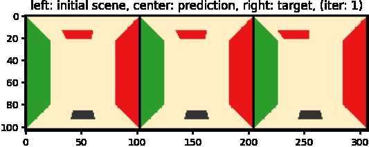

## Self-contained renderer optimization benchmarks




### Training
Run the following command to optimize the renderer for a moved red block
```
python trainval.py -e moved_block
```
While the experiment is running it should output the animation at the top in `results/animation.gif`

### Customize experiment
Modify the `exp_configs.py` to try out other types of rendering  and optimization methods.

